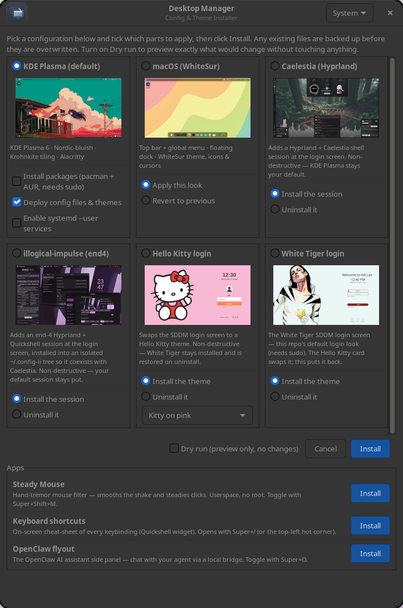
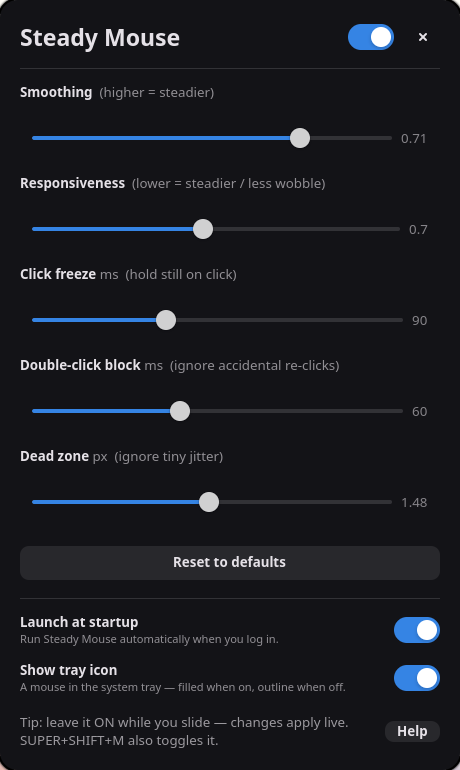
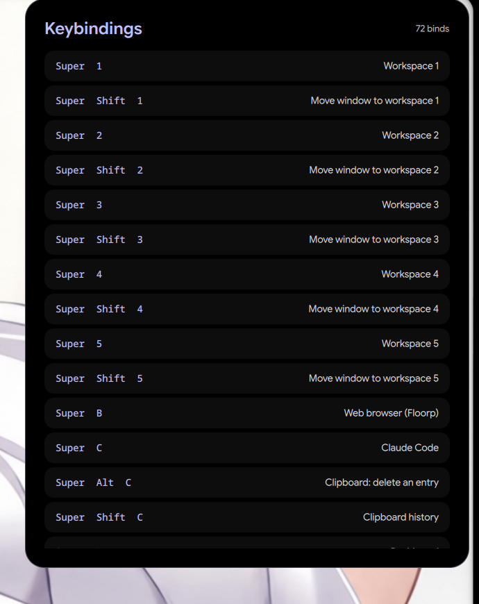

# Desktop Manager

Small app to load/restore saved **themes** for **KDE** and **SDDM**, with
**rices** for **Hyprland** (Caelestia, end4), plus a few **standalone apps** to
make your Linux experience easier — a self-contained snapshot of this machine's
look & configuration, with scripts to reproduce it on a fresh **CachyOS / Arch**
install.

<p align="center"></p>

Base setup captured: KDE Plasma 6 (Wayland) with the **Nordic / Nordic-bluish**
theme, **Krohnkite** tiling, **Alacritty** (Nord), **Fish** + Zsh (CachyOS
configs), **Micro** (Catppuccin), and the GTK/Qt theming to match.

## Standalone apps

<table>
  <tr>
    <td align="center" valign="top" width="33%">
      <a href="profiles/shakefree-mouse"></a><br>
      <b><a href="https://github.com/janszafranski/shakefree-mouse">Shakefree Mouse</a></b><br>
      <sub>tremor-smoothing filter + tray · own repo / AUR</sub>
    </td>
    <td align="center" valign="top" width="33%">
      <a href="profiles/openclaw-flyout"></a><br>
      <b><a href="profiles/openclaw-flyout">OpenClaw flyout</a></b><br>
      <sub>AI assistant side panel</sub>
    </td>
    <td align="center" valign="top" width="33%">
      <a href="profiles/keybinds"></a><br>
      <b><a href="profiles/keybinds">Keybinds</a></b><br>
      <sub>on-screen shortcut cheat-sheet</sub>
    </td>
  </tr>
</table>

## Layout

```
system-replica/
├── scripts/
│   ├── manifest.sh   # single source of truth: what gets backed up / restored
│   ├── collect.sh    # system  -> repo  (re-run to refresh this snapshot)
│   └── install.sh    # repo    -> system (deploy onto a fresh machine)
├── packages/
│   ├── pacman-native.txt         # explicit repo packages
│   ├── aur.txt                   # AUR / foreign packages
│   └── user-services-enabled.txt # enabled systemd --user units
└── files/            # the actual bundled config + themes
    ├── home/         -> $HOME            (.bashrc, .zshrc, .gtkrc-2.0, …)
    ├── config/       -> ~/.config        (fish, alacritty, micro, KDE rc files…)
    ├── local-share/  -> ~/.local/share   (Nordic icon themes, color-schemes,
    │                                       aurorae, kwin scripts, wallpapers)
    ├── icons/        -> ~/.icons         (Nordic-cursors)
    ├── bin/          -> ~/bin            (small helper scripts)
    └── system/       -> /                (SDDM login screen: /etc/sddm.conf.d
                                           + /usr/share/sddm/themes/<active>)
```

The Nordic GTK/icon/cursor themes, the Plasma *look-and-feel*, the Aurorae
window decoration, and the Krohnkite / UltrawideWindows KWin scripts are **not
in any package repo** on this system, so they are bundled here directly.

## Restore on a fresh install

```bash
git clone https://github.com/janszafranski/desktop-manager.git ~/system-replica
cd ~/system-replica

./scripts/install.sh --dry-run   # preview everything, change nothing
./scripts/install.sh             # packages + files + sddm + services
```

Individual stages can be run on their own: `files` (user config/themes, no
sudo), `packages`, `services`, and `sddm`. The **`sddm`** stage deploys the
login screen — the `/etc/sddm.conf.d` drop-ins plus the currently-active theme
directory under `/usr/share/sddm/themes/` — so it needs sudo. It does **not**
restart `sddm.service` (that would end your session); the new look shows up at
the next login screen. Re-run `./scripts/collect.sh sddm` any time you change
your login screen to refresh the bundled copy, then re-deploy it.

### GUI (KDE / any desktop)

Prefer clicking? `scripts/gui.sh` opens a graphical picker: choose a desktop
configuration and which stages to run (with a Dry-run option), then it launches
the work in a terminal window (so `sudo` prompts and live output work).

```bash
./scripts/gui.sh                 # run the picker now
./scripts/install-launcher.sh    # add "Desktop Manager" to your app menu
```

It uses the best available toolkit, in order:

1. **GTK** (`gui_gtk.py`, via `python-gobject`) — a titled window with an intro,
   a preview thumbnail and a grid of configuration cards. Preferred.
2. **yad** — single window with the preview image + checkboxes.
3. **kdialog / zenity** — plain checklist, no image.

The preview image comes from `preview.png` in the repo root (a desktop
screenshot); it's scaled to fit the dialog (full desktop, not cropped) and a
larger copy backs the click-to-enlarge popup. Replace that file to change it.

> **TODO — float the GUI window on tiling setups (UNRESOLVED).** On KDE +
> Krohnkite the window still tiles. Tried, none of which worked on Wayland:
> a `DIALOG` type hint; a stable `system-replica` WM_CLASS; adding
> `Desktop Manager` to Krohnkite's `floatingTitle`; adding `system-replica`
> to Krohnkite's `ignoreClass` (its exact `resourceClass`, confirmed via a
> KWin script) — even after a full Krohnkite unload/reload, not just
> `qdbus … reconfigure`. Konsole floats fine via `ignoreTitle`, so the
> mechanism works but not for this window. Next idea: a dedicated KWin window
> rule (force-float + size + center), or capture what differs at map-time.

Or run a single stage:

```bash
./scripts/install.sh packages    # sudo pacman + yay/paru from packages/*.txt
./scripts/install.sh files       # deploy configs & themes
./scripts/install.sh services    # enable systemd --user units
```

## Running on another machine (e.g. BigLinux)

The app itself is portable — it's just this repo plus Python's GTK bindings.
BigLinux is Manjaro/Arch-based, so the same `pacman` and SDDM layout apply.

```bash
sudo pacman -S --needed python-gobject gtk3 git   # GUI deps (yad/kdialog/zenity also work)
git clone https://github.com/janszafranski/desktop-manager.git ~/desktop-manager
~/desktop-manager/scripts/install-launcher.sh      # adds "Desktop Manager" to the app menu
# …or just run it directly:
~/desktop-manager/scripts/gui.sh
```

The clone carries everything, including the bundled SDDM themes. What's safe to
apply elsewhere, though, is narrower than on the machine this was captured from:

- **Portable:** the **SDDM** stage and the **login-theme profiles** (e.g. Hello
  Kitty). BigLinux also uses SDDM, with the same `/usr/share/sddm/themes/` and
  `/etc/sddm.conf.d/` layout, so these transplant cleanly. Tick **Dry run** first.
- **Be selective:** the **packages** stage installs from `packages/pacman-native.txt`,
  which is *this* machine's CachyOS set — some names differ or are absent on
  Manjaro. Leave it off unless you've reviewed the list.
- **Overwrites config:** the **files** stage replaces KDE/KWin config with this
  machine's. It backs up first, but on a machine you want to keep distinct,
  preview with **Dry run** before applying.

In short: clone it, launch it, and cherry-pick — the login-theme parts are the
ones that move over safely.

## Desktop profiles (alternative looks)

Beyond the captured "current" desktop, `profiles/<name>/` holds **alternative
looks** you can switch to and back from. Each profile is a self-contained,
reversible transformation and appears as its own card in the GUI grid (with an
**Apply / Revert** selector).

```
profiles/macos/
├── apply.sh        # transform KDE -> the look (idempotent)
├── revert.sh       # restore the exact pre-apply state
├── add-dock.js     # plasmashell script that builds the dock
├── wallpaper.jpg   # wallpaper the profile sets
├── preview.png     # card image
└── restore/        # snapshot taken on first apply (state.env + config files)
```

Run directly, or via the GUI (card → Apply/Revert → Install):

```bash
./profiles/macos/apply.sh    # switch to the look
./profiles/macos/revert.sh   # switch back
```

**How `apply.sh` works** (macOS example): installs the **WhiteSur** theme suite
entirely at **user level (no sudo)** — cloning vinceliuice's repos and running
their installers if the theme is missing — then applies the Global Theme
(look-and-feel) with `plasma-apply-lookandfeel --resetLayout`, sets a calm
*Monterey Light* wallpaper, and adds a native floating Plasma dock (Latte isn't
available on Plasma 6). It runs cleanly on a fresh machine as long as it has
network access for the theme clone.

**Revert safety:** the *first* `apply.sh` snapshots your live Global Theme,
color scheme, cursor, and panel layout into `restore/`. `revert.sh` restores
those files and re-applies your original Global Theme, so you always have a way
back. Your Nordic setup is also the repo's default captured config.

macOS is currently the only profile; add more by dropping another
`profiles/<name>/` directory and a matching entry in `CONFIGS` in
`scripts/gui_gtk.py`.

Existing files are **backed up** to `~/.config-backup-<timestamp>/` before being
overwritten — nothing is destroyed silently.

The `files` stage **applies live** when run inside a Plasma session: it stops
plasmashell before deploying (so a running shell can't overwrite the restored
panel layout on the next logout), then re-applies the colour scheme, reconfigures
KWin and restarts plasmashell — panels, wallpaper and decoration return without a
re-login. On a fresh machine with no running session it just deploys and prints a
reminder to log in. A log-out/in is still the surest way to make **every** app
(GTK/Qt) adopt the new theming.

## Refresh the snapshot from the current machine

```bash
./scripts/collect.sh                          # updates files/ + package lists
REPLICA_INCLUDE_PICTURES=1 ./scripts/collect.sh   # also bundle ~/Pictures/Wallpapers (~48MB)
git -C ~/system-replica add -A && git commit -m "refresh snapshot"
```

## What is deliberately NOT included

- Heavy per-machine app state: browsers (Zen/Firefox/Brave/LibreWolf/Chromium),
  Teams, LibreOffice, VS Code, GIMP/Krita caches. These aren't "the look" and
  are large / machine-specific.
- The 162MB `~/bin/pandoc` binary — install it with `sudo pacman -S pandoc-cli`.
- Secrets / credentials.

## Manual notes (things a script can't fully carry over)

- **SDDM Nordic login theme** comes from the AUR pkg `sddm-nordic-theme-git`
  (in `aur.txt`); select it in *System Settings → Login Screen (SDDM)*.
- **KWin tiling (Krohnkite):** after install, enable it in
  *System Settings → Window Management → KWin Scripts*.
- **libinput-gestures** needs the `libinput-gestures` package running:
  `libinput-gestures-setup autostart start`.
- **Fish/Zsh** source CachyOS's shared configs
  (`cachyos-fish-config` / `cachyos-zsh-config` packages — in the native list).
- Activities, per-activity wallpapers and desktop applet layout live in the
  bundled `plasma-org.kde.plasma.desktop-appletsrc` / `plasmarc`, but Plasma
  sometimes needs a re-login before they render correctly.

## To edit what gets captured

Everything is driven by the arrays in `scripts/manifest.sh`. Add/remove paths
there and both `collect.sh` and `install.sh` follow automatically.
