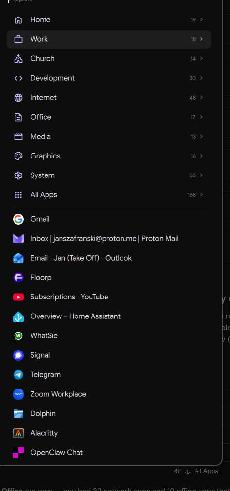

# omarchy-launcher — categorised app launcher

An Omarchy-style categorised application launcher for Caelestia / Hyprland: a
centred, **narrow portrait popup** that opens on **Favourites**. Following
Omarchy's root-menu pattern, the categories are the first rows of the one list —
folders with a count and a chevron — and under a hairline come the apps of the
default category. Open a folder and its apps replace the rows under the same
search line; walk back out and you land on the folder you came from.

Built by **Coding Colin** (Paperclip agent) for this desktop.

## Install
Desktop Manager → Apps → **App launcher → Install**, or `./install.sh`.
Requires **quickshell**. Deploys the launcher (`qs -c omarchy-launcher`), the
`omarchy-launcher` wrapper, and `categories.json`, then adds the **Super+Space**
binding + login autostart to `~/.config/hypr/hyprland.lua` (marker-guarded,
idempotent). Caelestia's own launcher is moved to **Super+Shift+Space** so
nothing is lost. An existing `categories.json` is never overwritten.

`./uninstall.sh` reverses the wiring and removes the files (your
`categories.json` is kept).

## Keys

| Key | Action |
| --- | --- |
| `Super + Space` | open / close (primary) |
| type | search the current level |
| `↑` `↓` / `PgUp` `PgDn` | move the selection |
| `Enter` | launch app — or, on a folder row, open that category |
| `→` | open the folder under the selection |
| `←` / `Backspace` (empty search) | walk back out to root |
| `Tab` / `Shift+Tab` | next / previous category |
| `Alt + 1…9` | open the Nth folder from anywhere |
| `Esc` | clear search → back to root → close |
| click outside | close |

## App List Config window

You don't have to hand-edit JSON. Colin added an in-launcher editor, the **App
List Config** window: the pinned `tune`-icon row at the top of the System folder,
or `omarchy-launcher config`. It lets you:

- pick a category on the left and **reorder / add / remove** its apps (add via a
  live "ADD AN APP" search; All Apps is generated, so there's nothing to edit
  there);
- tune the **Highlight** (selection pill) and **Faint outline** (card border) —
  each has a source (text / accent / outline / surface / **custom** `#rrggbb`)
  plus a strength/opacity slider. Every source but Custom is read live from
  Caelestia's scheme, so a wallpaper recolour still drives the theme.

**Save** writes `~/.config/omarchy-launcher/categories.json` **and**
`appearance.json` (a new file — delete it to fall back to defaults). Both are
watched, so changes apply on the next open, no restart.

## Categories

Everything lives in `~/.config/omarchy-launcher/categories.json`
(`omarchy-launcher edit` opens it, or use the App List Config window above). The
file is watched — save it and the next open picks the change up, no restart. See
**[APP-README.md](APP-README.md)** for the full category schema, XDG
auto-population, and design notes.

## Files
- `omarchy-launcher` → `~/.local/bin/` — the wrapper you bind to a key (toggle / open / close / restart / edit / daemon)
- `shell.qml` → `~/.config/quickshell/omarchy-launcher/` — the Quickshell UI
- `categories.json` → `~/.config/omarchy-launcher/` — category + favourites definitions
